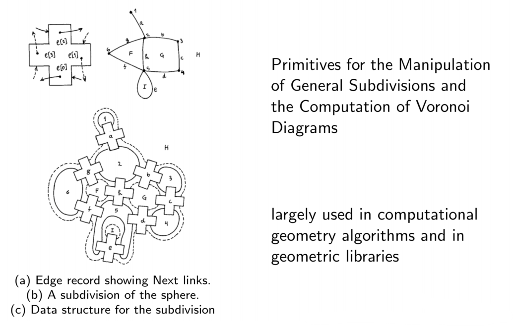
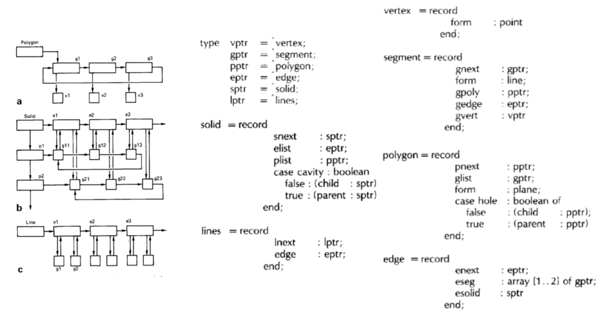
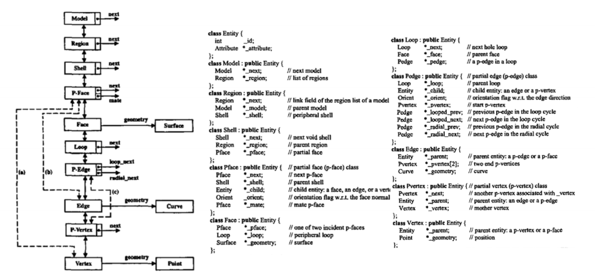
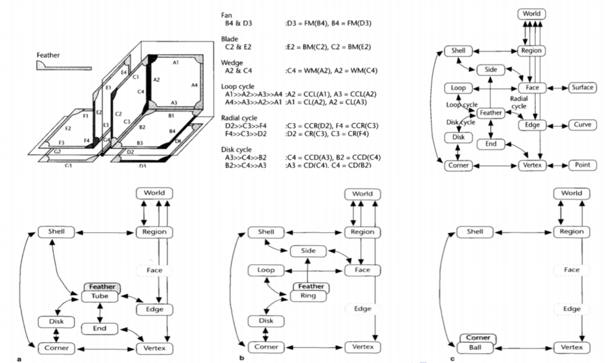

# Geometric and topological computing

\framesubtitle{rethinking some foundations}

::: columns

:::: column
Complexity of geometric information stems
from dramatic increase in
*size*, *diversity*, and *complexity*
of **geometric data**:

* point clouds,
* boundary meshes,
* NURBs representations,
* finite element meshes,
* CT scans,
* and so on

::::

:::: column
Emerging applications (e.g. **medical 3D**)
require the **convergence of data structures**
from:

* 3d computer imaging
* computer graphics
* solid modeling
* computer-aided geometric design
* discrete meshing of domains
* physical simulations
::::

:::

The goals of *unification*, *scalability*, and *distributed computing*
call for *rethinking some foundations* of geometric and topological computing

# Motivation for a new start

::: columns

:::: column 

## Quad-edge data structure \cite{Guibas1985}

\ 

## Hybrid Edge data sturcture \cite{Kalay1989}

a topological data structure for vertically integrated geometric modelling

\ 

::::

:::: column

## Partial-Entity data structure \cite{SangHunLee2001}

Compact Non-Manifold Boundary Representation Based on Partial Topological Entities
\ 

## Coupling Entities data structure \cite{yamaguchi1995nonmanifold}
\ 

::::

:::

## first sub
* asdf
* neks

## second sub
* asf
* woens

# third slide
asdfa sd asd fas

# My slide {.columns}

## First column

contents

## Second column

contents
